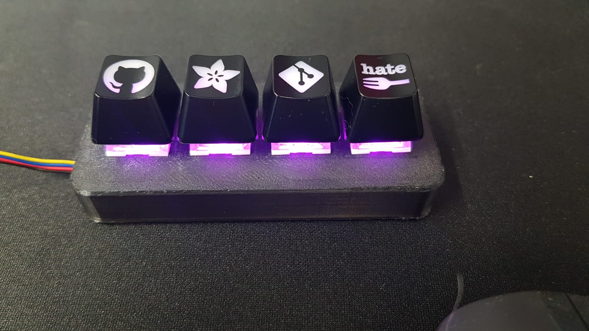

# Circuit-python-neokey-1x4
Circuit python program to for the Adafruit Neokey 1x4 keypad to send keycodes.  Set up to send F13-F16 but can be set up for anything, including multimedia commands.

I printed this enclosure off **Thingiverse** https://www.thingiverse.com/thing:4948558

I am using **AutoHotkey** to trigger macros on my Windows machine https://www.autohotkey.com/

